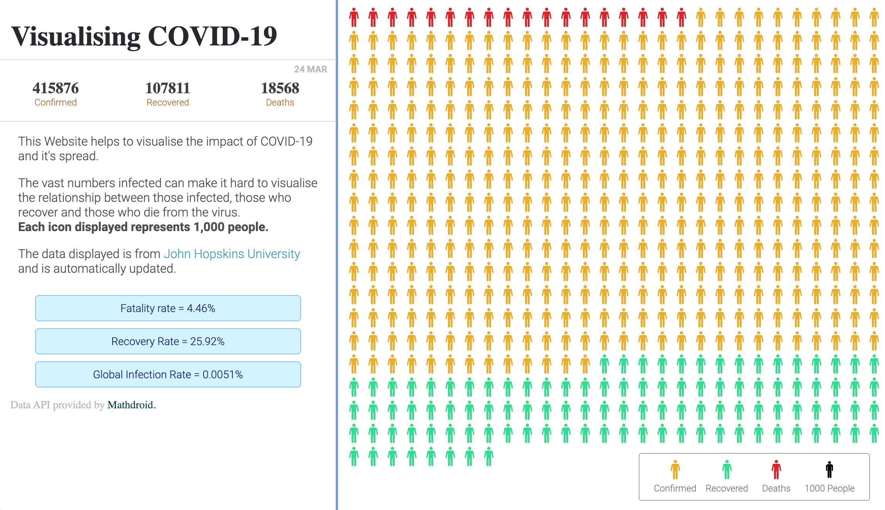

## Project Title

## Deployment

https://msmfa.github.io/corona-dashboard/

## Screenshot

## Build Tools & Languages

- React
- Visual Studio Code
- Git
- Github

## What did I learn?

React
Working with APIS

## Dependencies

UUID4 for generating unique keys

## Authors

Michael Sydney Moore

## Acknowledgments

John Hopkins Coronavirus Resource Center

Data API provided by https://github.com/mathdroid
